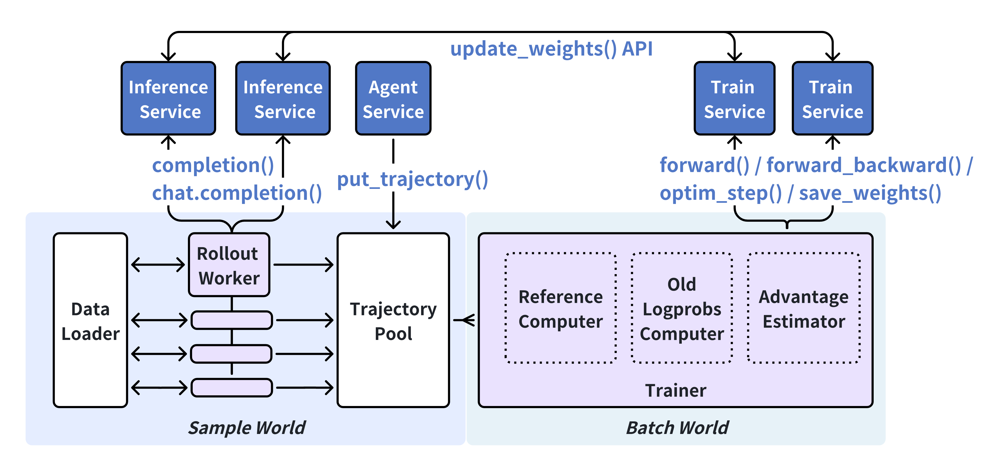

# NexRL Developer Guide

## Overview

NexRL is a large-scale distributed reinforcement learning training framework designed for modern RL applications. NexRL provides a scalable, modular architecture that seamlessly supports various training and inference backends.

### Key Features

- **Multiple Launch Mode Support**: Seamlessly runs in both local and Ray distributed modes
- **Modular Design**: Clean separation of concerns with well-defined interfaces and extensible components
- **Training-as-a-Service & Rollout-as-a-Service**: Unified API architecture that seamlessly supports different training and inference frameworks through service abstraction
- **Resource Management**: Intelligent placement and co-location of services for optimal performance
- **Activity Tracking**: Comprehensive monitoring and health checking system for production deployments
- **Error Handling**: Centralized error reporting and recovery mechanisms

## Architecture Overview

NexRL follows a modular architecture where components communicate through explicit interfaces and APIs.




### Core Components

1. **NexRLController**: Main orchestrator that initializes and coordinates all components
2. **DataLoader**: Provides input data for rollout workers (training and validation)
3. **RolloutWorkers**: Execute environment interactions and generate trajectories
4. **TrajectoryPool**: Collects and batches trajectories from rollout workers
5. **AlgorithmProcessor**: Processes trajectory batches for training
6. **TrainBatchPool**: Manages training batches for models
7. **TrainWorker**: Performs actual model training via training service clients
8. **WeightSyncController**: Manages model weights and synchronization
9. **Validator**: Collects validation trajectories and computes metrics
10. **ActivityTracker**: Monitors system health and activity, coordinates experiment logging
11. **RayResourceManager**: Handles distributed resource allocation and actor co-location

## Core Data Types

### nexrl_types.py

Core type definitions used throughout the framework.

#### ModelTag
```python
ModelTag = str  # Type alias for model identification
```

Used to identify different models within the system.

#### Trajectory
```python
Trajectory = dict[str, Any]
```

Represents a single trajectory containing environment interaction data. Common keys include:
- `prompt`: Input prompt for LLM
- `response`: LLM response
- `finish_reason`: Completion status
- `model_tag`: Associated model identifier

#### Batch
```python
@dataclass
class Batch:
    values: dict[str, Any]      # Tensor or data arrays, length = metadata['batch_size']
    metadata: dict[str, Any]    # Batch metadata including 'batch_size'
```

**Methods:**
- `__len__() -> int`: Returns batch size from metadata
- `copy() -> Batch`: Creates a deep copy of the batch
- `to_dict() -> dict[str, Any]`: Converts batch to single dictionary (metadata keys overwrite values keys)
- `remove_redundant_left_padding(data, pad_token_id, fields, anchor_field, max_strip_threshold) -> Batch`: Static method that removes redundant left padding tokens common across all sequences
- `remove_redundant_right_padding(data, pad_token_id, fields, anchor_field, max_strip_threshold) -> Batch`: Static method that removes redundant right padding tokens common across all sequences
- `to_nextrainer_batch() -> dict[str, Any]`: Converts batch to NexTrainer format with separated tensor/non-tensor values and metadata

#### NexRLRole
```python
class NexRLRole(Enum):
    ROLLOUT_WORKER = "rollout_worker"
    TRAIN_WORKER = "train_worker"
    ALGORITHM_PROCESSOR = "algorithm_processor"
    TRAJECTORY_POOL = "trajectory_pool"
    TRAIN_BATCH_POOL = "train_batch_pool"
    WEIGHT_SYNC_CONTROLLER = "weight_sync_controller"
    DATA_LOADER = "data_loader"
    VALIDATE_DATALOADER = "validate_dataloader"
    VALIDATOR = "validator"
```

Defines different component roles for resource pool mapping.

## Core Module Classes

### NexRLModule

Base class for all NexRL components, enabling Ray colocation compatibility.

```python
class NexRLModule(ABC):
    def __init__(self):
        self._module_name: str = "invalid"
        self._activity_tracker: ActivityTrackerProxy = None
```

**Purpose**: Provides common interface for all NexRL modules to work with Ray resource management and activity tracking.

**Methods:**
- `set_activity_tracker(tracker: ActivityTrackerProxy)`: Sets the activity tracker for this module
- `set_module_name(module_name: str)`: Sets the name of this module
- `get_module_name() -> str`: Gets the name of this module
- `health_check() -> bool`: Health check method to verify the module is alive and responsive, used during initialization and monitoring
- `easy_dump(value, keys, value_formatter)`: Convenience method to dump values with automatic module context for debugging purposes

## Main Controller

### NexRLController

The main orchestrator responsible for initializing, coordinating, and monitoring all framework components.

#### Constructor
```python
def __init__(self, config: DictConfig)
```

**Parameters:**
- `config`: Hydra configuration containing all module settings

**Functionality:**
- Initializes all framework modules based on launch mode
- Sets up Ray resources in distributed mode
- Establishes inter-module references

#### Core Methods

##### run()
```python
def run() -> None
```

Starts the training process by launching all components and entering monitoring loop.

**Process:**
1. Initializes train workers with final configuration
2. Loads initial checkpoint (or resumes from existing)
3. Optionally runs validation before training
4. Starts all worker components asynchronously
5. Monitors system health and activity
6. Checks for weight sync validation triggers
7. Checks for completion conditions
8. Handles graceful shutdown

##### stop()
```python
def _stop()
```

Gracefully stops all components and waits for activity completion.

**Features:**
- Signals all workers to stop
- Waits for quiescence with timeout
- Logs remaining activities on timeout

#### Internal Methods

##### _check_finish() -> bool
```python
def _check_finish() -> bool
```

Determines if training should stop based on:
- Maximum training steps reached
- System quiescence (all pools empty, no active work)

##### _check_module_liveness(timeout: float = 5.0) -> bool
```python
def _check_module_liveness(self, timeout: float = 5.0) -> bool
```

**Parameters:**
- `timeout`: Ray operation timeout in seconds

**Returns:** True if all modules are alive, False if any are dead

##### _check_module_exceptions() -> bool
```python
def _check_module_exceptions(self) -> bool
```

**Returns:** True if system is healthy, False if critical errors detected

##### _load_initial_checkpoint()
```python
def _load_initial_checkpoint()
```

Loads initial checkpoint or prepares for training from scratch. Creates sync weight buffer and performs initial weight sync to inference service.

##### _load_resume_checkpoint()
```python
def _load_resume_checkpoint()
```

Loads checkpoint based on resume configuration (auto or from_path). Supports automatic detection of latest checkpoint or explicit path specification.

##### _find_latest_checkpoint(checkpoint_folder: str) -> str | None
```python
def _find_latest_checkpoint(self, checkpoint_folder: str) -> str | None
```

Finds the latest checkpoint in the given folder by parsing `global_step_*` directories.

##### _run_validate(model_tag: ModelTag)
```python
def _run_validate(self, model_tag: ModelTag)
```

Runs validation cycle after a weight sync event. Switches workers to validation mode, waits for completion, computes metrics, and switches back to training mode.

##### _start_validate(model_tag: ModelTag)
```python
def _start_validate(self, model_tag: ModelTag)
```

Starts validation by switching rollout workers to validation mode.

##### _end_validate(model_tag: ModelTag)
```python
def _end_validate(self, model_tag: ModelTag)
```

Ends validation by computing metrics, logging results, switching workers back to training mode, and notifying weight sync controller.

## Data Loading

### BaseDataLoader

Abstract base class for data input components.

#### Constructor
```python
def __init__(self, config: DictConfig, is_validate: bool = False)
```

**Parameters:**
- `config`: Configuration for the data loader
- `is_validate`: Whether this dataloader is for validation (affects behavior and tracking)

#### Abstract Methods

##### __len__() -> int
```python
def __len__(self) -> int
```

**Returns:** Number of remaining data items

##### __getitem__(index: int) -> dict[str, Any]
```python
def __getitem__(self, index: int) -> dict[str, Any]
```

**Parameters:**
- `index`: Index of data item to retrieve

**Returns:** Single data item as dictionary

##### get_next_item() -> dict[str, Any] | None
```python
def get_next_item(self) -> dict[str, Any] | None
```

**Returns:** Next data item in sequence, or None if exhausted

##### is_finished() -> bool
```python
def is_finished(self) -> bool
```

**Returns:** True if no more data available

##### can_return_item() -> bool
```python
def can_return_item(self) -> bool
```

**Returns:** True if the data loader can return an item currently

##### reset()
```python
def reset() -> None
```

Resets the data loader to initial state (used for validation cycles)

#### Data Management Methods

##### add_item(item: dict[str, Any])
```python
def add_item(self, item: dict[str, Any]) -> None
```

**Parameters:**
- `item`: Data item to add (added to end by default)

##### add_item_front(item: dict[str, Any])
```python
def add_item_front(self, item: dict[str, Any]) -> None
```

**Parameters:**
- `item`: Data item to add to beginning of queue

##### add_item_back(item: dict[str, Any])
```python
def add_item_back(self, item: dict[str, Any]) -> None
```

**Parameters:**
- `item`: Data item to add to end of queue

## LLM Service Integration

### LLMServiceClient

Service client for interacting with LLM APIs, encapsulating OpenAI client functionality.

#### Constructor
```python
def __init__(self, config: DictConfig)
```

**Parameters:**
- `config`: Configuration containing LLM settings

**Initializes:**
- OpenAI client with API key and base URL
- Model tag and weight sync coordination settings

#### Methods

##### completion(prompt: str, **kwargs) -> dict[str, Any]
```python
def completion(self, prompt: str, **kwargs) -> dict[str, Any]
```

**Parameters:**
- `prompt`: Input text prompt
- `**kwargs`: Additional completion parameters

**Returns:** Dictionary containing:
- `prompt`: Original input prompt
- `response`: LLM generated text
- `finish_reason`: Completion status
- Additional passed kwargs

**Features:**
- Automatic retry logic with configurable max_retries
- Weight sync coordination (blocks if weight sync in progress)
- Error handling and logging

##### generate(messages: list[dict[str, Any]], **kwargs) -> dict[str, Any]
```python
def generate(self, messages: list[dict[str, Any]], **kwargs) -> dict[str, Any]
```

**Parameters:**
- `messages`: List of message dictionaries for chat completion
- `**kwargs`: Additional generation parameters

**Returns:** Dictionary containing:
- `messages`: Original input messages
- `response`: Generated response text
- `tool_calls`: Any tool calls made
- `finish_reason`: Completion status
- Additional passed kwargs

##### set_weight_sync_controller(controller)
```python
def set_weight_sync_controller(self, controller: WeightSyncController)
```

**Parameters:**
- `controller`: Weight synchronization controller reference

## Rollout Workers

### BaseRolloutWorker

Abstract base class for rollout execution workers that interact with LLM services.

#### Constructor
```python
def __init__(self, config: DictConfig)
```

**Parameters:**
- `config`: Worker configuration including LLM settings

**Initializes:**
- LLMServiceClient for LLM interactions
- Threading components for async execution
- Module references (set via `set_module_references`)

#### Setup Methods

##### set_module_references(trajectory_pool, dataloader, weight_sync_controller, validate_dataloader, validator)
```python
def set_module_references(self, trajectory_pool: TrajectoryPool, dataloader: BaseDataLoader, weight_sync_controller: WeightSyncController, validate_dataloader: BaseDataLoader, validator: Validator)
```

**Parameters:**
- `trajectory_pool`: Reference to trajectory collection pool
- `dataloader`: Reference to data source
- `weight_sync_controller`: Reference to weight synchronization controller
- `validate_dataloader`: Reference to validation data source
- `validator`: Reference to validation trajectory collector

##### set_activity_tracker(tracker)
```python
def set_activity_tracker(self, tracker: ActivityTrackerProxy)
```

**Parameters:**
- `tracker`: Activity monitoring proxy

#### Execution Methods

##### run()
```python
def run()
```

Starts the worker thread and begins the main processing loop.

**Preconditions:**
- Module references must be set
- Activity tracker must be set

##### stop()
```python
def stop()
```

Gracefully stops the worker and waits for thread completion.

##### begin_validate()
```python
def begin_validate()
```

Switches the worker to validation mode. The worker will use the validation dataloader and send trajectories to the validator.

##### end_validate()
```python
def end_validate()
```

Switches the worker back to training mode. The worker will use the training dataloader and send trajectories to the trajectory pool.

##### step(task: dict[str, Any]) -> str | None
```python
def step(self, task: dict[str, Any]) -> str | None
```

**Parameters:**
- `task`: Single task to process

**Returns:**
- `"success"`: Trajectory processed and added successfully
- `"fail"`: Failed to process trajectory
- `"re-rollout"`: Should retry processing (weight sync in progress)
- `None`: Processing failed before trajectory creation

**Abstract method** - Must be implemented by derived classes to define specific worker behavior.

#### LLM Interface Methods

Workers access LLM functionality through the `_llm_client` (LLMServiceClient instance):

##### _llm_client.completion(prompt: str, **kwargs) -> dict[str, Any]
```python
def _llm_client.completion(self, prompt: str, **kwargs) -> dict[str, Any]
```

**Parameters:**
- `prompt`: Input text prompt
- `**kwargs`: Additional completion parameters (model, max_tokens, temperature, etc.)

**Returns:** Dictionary containing:
- `prompt`: Original input prompt
- `response`: LLM generated text
- `finish_reason`: Completion status
- Additional passed kwargs

**Features:**
- Automatic retry logic with configurable max_retries
- Weight sync coordination (blocks during sync)
- Error handling and logging

##### _llm_client.generate(messages: list[dict[str, Any]], **kwargs) -> dict[str, Any]
```python
def _llm_client.generate(self, messages: list[dict[str, Any]], **kwargs) -> dict[str, Any]
```

**Parameters:**
- `messages`: List of message dictionaries for chat completion
- `**kwargs`: Additional generation parameters

**Returns:** Dictionary containing:
- `messages`: Original input messages
- `response`: Generated response text
- `tool_calls`: Any tool calls made
- `finish_reason`: Completion status
- Additional passed kwargs

#### Data Flow Methods

##### _put_trajectory(trajectory: Trajectory) -> str
```python
def _put_trajectory(self, trajectory: Trajectory) -> str
```

**Parameters:**
- `trajectory`: Completed trajectory to submit

**Returns:**
- `"success"`: Trajectory submitted successfully
- `"fail"`: Failed to submit trajectory
- `"re-rollout"`: Should retry (weight sync in progress)

##### _get_rollout_task() -> dict[str, Any] | None
```python
def _get_rollout_task(self) -> dict[str, Any] | None
```

**Returns:** Next task from dataloader, or None if none available

**Features:**
- Automatic sleep to prevent busy waiting
- Non-blocking operation

##### _put_rollout_task(task: dict[str, Any]) -> bool
```python
def _put_rollout_task(self, task: dict[str, Any]) -> bool
```

**Parameters:**
- `task`: Task to return to dataloader for reprocessing

**Returns:** True if successfully returned, False otherwise

### SimpleRolloutWorker

Concrete implementation of BaseRolloutWorker with basic LLM completion functionality.

#### Constructor
```python
def __init__(self, config: DictConfig)
```

Inherits from BaseRolloutWorker.

#### step(task: dict[str, Any]) -> str | None
```python
def step(self, task: dict[str, Any]) -> str | None
```

**Parameters:**
- `task`: Task dictionary containing `prompt` field

**Returns:**
- `"success"`: Trajectory processed and submitted successfully
- `"fail"`: Failed to submit trajectory
- `"re-rollout"`: Should retry processing
- `None`: Processing failed (missing prompt)

**Process:**
1. Extracts prompt from task
2. Calls LLMServiceClient completion
3. Creates trajectory with prompt, response, and task metadata
4. Submits trajectory to trajectory pool
5. Returns submission result

**Error Handling:**
- Returns None if prompt missing
- Propagates result from trajectory submission

### AgentRolloutWorker

Advanced rollout worker implementation for agent-based tasks with tool calling and multi-turn interaction support.

#### Constructor
```python
def __init__(self, config: DictConfig)
```

Inherits from BaseRolloutWorker and adds agent-specific functionality.

#### Key Features
- Supports chat-based interactions with message history
- Tool calling capabilities through LLM generate method
- Multi-turn conversation management
- Agent-specific trajectory formatting

This worker type is designed for more complex agent tasks that require stateful interactions and tool usage.

## Trajectory Management

### TrajectoryPool

Multi-store trajectory pool that manages separate TrajectoryPoolInstance objects for different models, providing flexible batching strategies and weight synchronization coordination.

#### Constructor
```python
def __init__(self, config: DictConfig)
```

**Parameters:**
- `config`: Pool configuration including grouping and batching settings

**Configuration Options:**
- `key_list`: List of keys for grouping trajectories
- `group_size`: Number of trajectories per group
- `batch_size`: Default batch size for retrieval
- `check_batch_ready_function`: Batch readiness criteria ("batch_size", "loaded_batch_finished")

#### Core Methods

##### put_trajectory(trajectory: Trajectory) -> str
```python
def put_trajectory(self, trajectory: Trajectory) -> str
```

**Parameters:**
- `trajectory`: Trajectory data to store

**Returns:**
- `"success"`: Trajectory stored successfully
- `"fail"`: Failed to store trajectory
- `"re-rollout"`: Should retry (weight sync in progress)

**Process:**
1. Extracts ModelTag from trajectory (defaults to "default")
2. Creates or retrieves appropriate TrajectoryPoolInstance
3. Adds trajectory to instance (may block during weight sync)

##### get_batch(batch_size: int | None = None, model_tag: ModelTag | None = None) -> Batch | None
```python
def get_batch(self, batch_size: int | None = None, model_tag: ModelTag | None = None) -> Batch | None
```

**Parameters:**
- `batch_size`: Number of trajectories to include
- `model_tag`: Specific model to get batch from

**Returns:** Batch of trajectories, or None if insufficient samples

**Behavior:**
- If `model_tag` is None, tries any available store
- If specified model_tag has no store, returns None

##### get_batch_any(batch_size: int | None = None) -> Batch | None
```python
def get_batch_any(self, batch_size: int | None = None) -> Batch | None
```

**Parameters:**
- `batch_size`: Number of trajectories to retrieve

**Returns:** Batch from any store with sufficient samples, or None

##### is_empty(model_tag: ModelTag | None = None) -> bool
```python
def is_empty(self, model_tag: ModelTag | None = None) -> bool
```

**Parameters:**
- `model_tag`: Specific model to check, or None for all models

**Returns:** True if specified store (or all stores) is empty

##### get_model_tags() -> list[ModelTag]
```python
def get_model_tags(self) -> list[ModelTag]
```

**Returns:** List of all ModelTags with active stores

### TrajectoryPoolInstance

Individual pool instance managing trajectories for a single model with weight synchronization coordination.

#### Methods

##### set_module_references(dataloader, weight_sync_controller, activity_tracker)
```python
def set_module_references(self, dataloader: BaseDataLoader, weight_sync_controller: WeightSyncController, activity_tracker: ActivityTrackerProxy)
```

**Parameters:**
- `dataloader`: Reference to data loader
- `weight_sync_controller`: Weight synchronization controller
- `activity_tracker`: Activity tracking proxy

##### put_trajectory(trajectory: Trajectory) -> str
```python
def put_trajectory(self, trajectory: Trajectory) -> str
```

**Parameters:**
- `trajectory`: Trajectory to add

**Returns:**
- `"success"`: Added successfully
- `"fail"`: Failed to add
- `"re-rollout"`: Weight sync in progress, should retry

##### notify_weight_sync_starting()
```python
def notify_weight_sync_starting()
```

Blocks new trajectory additions during weight synchronization.

##### unlock_for_weight_sync()
```python
def unlock_for_weight_sync()
```

Unblocks trajectory additions after weight synchronization completes.

### Trajectory Store Types

TrajectoryPoolInstance automatically creates appropriate stores based on configuration:

#### SimpleTrajectoryStore
- **Use Case**: No grouping required
- **Behavior**: Directly adds trajectories to finished samples
- **Configuration**: Empty `key_list`

#### GroupedTrajectoryStore
- **Use Case**: Single-level grouping (e.g., by user ID)
- **Behavior**: Groups trajectories by specified key, releases when group reaches target size
- **Configuration**: Single item in `key_list`

#### HierarchicalTrajectoryStore
- **Use Case**: Multi-level grouping (e.g., by user ID then session ID)
- **Behavior**: Creates nested hierarchy, releases leaf groups when complete
- **Configuration**: Multiple items in `key_list`

## Algorithm Processing

### BaseAlgorithmProcessor

Abstract base class for processing trajectories into training batches.

#### Constructor
```python
def __init__(self, config: DictConfig)
```

**Parameters:**
- `config`: Processor configuration including batch_size

#### Setup Methods

##### set_module_references(trajectory_pool, train_batch_pool)
```python
def set_module_references(self, trajectory_pool: TrajectoryPool, train_batch_pool: TrainBatchPool) -> None
```

**Parameters:**
- `trajectory_pool`: Source of trajectory batches
- `train_batch_pool`: Destination for processed batches

##### set_activity_tracker(tracker)
```python
def set_activity_tracker(self, tracker: ActivityTrackerProxy)
```

**Parameters:**
- `tracker`: Activity monitoring proxy

#### Execution Methods

##### run()
```python
def run()
```

Starts the processor thread and begins the main processing loop.

##### stop()
```python
def stop()
```

Gracefully stops the processor.

#### Abstract Methods

##### _fit(batch: Batch, update_fn: str)
```python
def _fit(self, batch: Batch, update_fn: str)
```

**Parameters:**
- `batch`: Trajectory batch to process
- `update_fn`: Update function identifier

**Purpose:** Process trajectories through model services to compute advantages, logprobs, etc.

#### Utility Methods

##### _get_batch(batch_size: int | None = None) -> Batch
```python
def _get_batch(self, batch_size: int | None = None) -> Batch
```

**Parameters:**
- `batch_size`: Number of trajectories to fetch

**Returns:** Batch from trajectory pool

##### _put_batch(batch: Batch, update_fn: str) -> bool
```python
def _put_batch(self, batch: Batch, update_fn: str) -> bool
```

**Parameters:**
- `batch`: Processed batch to submit
- `update_fn`: Update function identifier

**Returns:** True if successfully submitted

## Training Components

### TrainBatchPool

Manages training batches organized by model tags.

#### Constructor
```python
def __init__(self, config: DictConfig)
```

**Parameters:**
- `config`: Pool configuration

#### Methods

##### put_batch(batch: Batch, update_fn: str) -> bool
```python
def put_batch(self, batch: Batch, update_fn: str) -> bool
```

**Parameters:**
- `batch`: Training batch to store
- `update_fn`: Update function identifier

**Returns:** True if successfully stored

**Process:**
1. Extracts model_tag from batch metadata (defaults to "default")
2. Creates model queue if needed
3. Appends batch to appropriate queue

##### get_batch(model: ModelTag | None = "default") -> Batch | None
```python
def get_batch(self, model: ModelTag | None = "default") -> Batch | None
```

**Parameters:**
- `model`: Model identifier to get batch for

**Returns:** Training batch for specified model, or None if unavailable

##### is_empty() -> bool
```python
def is_empty(self) -> bool
```

**Returns:** True if all model queues are empty

### Validator

Collects validation trajectories, computes metrics, and logs results. Unlike TrajectoryPool, this component focuses on simple collection without batching logic.

#### Constructor
```python
def __init__(self, config: DictConfig)
```

**Parameters:**
- `config`: Validator configuration

#### Setup Methods

##### set_module_references(validate_dataloader)
```python
def set_module_references(self, validate_dataloader: BaseDataLoader)
```

**Parameters:**
- `validate_dataloader`: Reference to validation data loader

#### Methods

##### put_trajectory(trajectory: Trajectory) -> str
```python
def put_trajectory(self, trajectory: Trajectory) -> str
```

**Parameters:**
- `trajectory`: Validation trajectory to store

**Returns:** "success" to match TrajectoryPool.put_trajectory signature

Stores a validation trajectory for later metric computation.

##### is_complete() -> bool
```python
def is_complete(self) -> bool
```

**Returns:** True if all validation trajectories have been collected

Checks if validation dataloader is drained and rollout workers are quiescent.

##### compute_and_log_metrics() -> dict[str, float]
```python
def compute_and_log_metrics(self) -> dict[str, float]
```

**Returns:** Dictionary of computed metrics with "val/" prefix

Computes mean of each score key across all trajectories and logs results via activity tracker.

##### clear()
```python
def clear()
```

Clears all stored validation trajectories.

### TrainWorker

Concrete implementation for model training workers that interfaces with training services (e.g., NexTrainer).

#### Constructor
```python
def __init__(self, config: DictConfig)
```

**Parameters:**
- `config`: Worker configuration including total_train_steps and train_service settings

**Initializes:**
- Train service client for model training
- Training statistics tracking
- Threading components for async execution
- Checkpoint saving support

#### Setup Methods

##### set_module_references(train_batch_pool, weight_sync_controller)
```python
def set_module_references(self, train_batch_pool: TrainBatchPool, weight_sync_controller: WeightSyncController)
```

**Parameters:**
- `train_batch_pool`: Source of training batches
- `weight_sync_controller`: Reference to weight synchronization controller

##### set_activity_tracker(tracker)
```python
def set_activity_tracker(self, tracker: ActivityTrackerProxy) -> None
```

**Parameters:**
- `tracker`: Activity monitoring proxy

#### Execution Methods

##### initialize_workers() -> None
```python
def initialize_workers() -> None
```

Initializes training service workers with the final configuration. For NexTrainer backend, this sends actor config to workers and initializes the model on GPU.

##### run() -> None
```python
def run() -> None
```

Starts the training worker thread and begins the main training loop.

##### stop() -> None
```python
def stop() -> None
```

Gracefully stops the training worker and waits for any ongoing checkpoint saves to complete.

##### get_train_step() -> int
```python
def get_train_step(self) -> int
```

**Returns:** Current training step count

##### set_train_step(step: int) -> None
```python
def set_train_step(self, step: int) -> None
```

**Parameters:**
- `step`: The training step to set

Sets the current training step (used for resuming from checkpoint).

#### Internal Methods

##### _step(batch: Batch)
```python
def _step(self, batch: Batch)
```

**Parameters:**
- `batch`: Training batch to process

Trains the model on a single batch, updates metrics, saves checkpoints if needed, and notifies weight sync controller.

##### _get_batch() -> Batch | None
```python
def _get_batch(self) -> Batch | None
```

**Returns:** Next training batch, or None if unavailable

### WeightSyncController

Manages model weights and synchronization coordination across the system. Supports multiple synchronization modes and coordinates with trajectory pools and rollout services.

#### Constructor
```python
def __init__(self, config: DictConfig)
```

**Parameters:**
- `config`: Weight manager configuration

**Configuration Options:**
- `sync_mode`: Synchronization mode ("sync", "fully-async", "batch-async")
- `staleness_threshold`: Maximum staleness allowed in async modes
- `checkpoint_manager`: Checkpoint manager configuration

#### Setup Methods

##### set_module_references(dataloader, trajectory_pool)
```python
def set_module_references(self, dataloader: BaseDataLoader, trajectory_pool: TrajectoryPool) -> None
```

**Parameters:**
- `dataloader`: Reference to data loader
- `trajectory_pool`: Reference to trajectory pool

#### Coordination Methods

##### check_rollout_service_status(model_tag: ModelTag) -> Literal["continue", "block"]
```python
def check_rollout_service_status(self, model_tag: ModelTag) -> Literal["continue", "block"]
```

**Parameters:**
- `model_tag`: Model to check status for

**Returns:**
- `"continue"`: Rollout service can continue processing
- `"block"`: Rollout service should block for weight sync

##### trajectory_pool_notify_batch_ready(model_tag: ModelTag)
```python
def trajectory_pool_notify_batch_ready(self, model_tag: ModelTag) -> None
```

**Parameters:**
- `model_tag`: Model with ready batch

Coordinates weight synchronization when training batches are ready.

##### train_worker_notify_weight_update(worker_name: str, model_tag: ModelTag)
```python
def train_worker_notify_weight_update(self, worker_name: str, model_tag: ModelTag) -> None
```

**Parameters:**
- `worker_name`: Name of the training worker
- `model_tag`: Model that was trained

Handles training completion and performs synchronous weight synchronization. May trigger validation if configured.

##### sync_weight_to_rollout_service(model_tag: ModelTag)
```python
def sync_weight_to_rollout_service(self, model_tag: ModelTag) -> None
```

**Parameters:**
- `model_tag`: Model to sync weights for

Synchronizes model weights from training service to rollout/inference service.

##### get_rollout_model_version(model_tag: ModelTag) -> int
```python
def get_rollout_model_version(self, model_tag: ModelTag) -> int
```

**Parameters:**
- `model_tag`: Model to get version for

**Returns:** Current rollout model version number

##### is_waiting_for_validation() -> bool
```python
def is_waiting_for_validation(self) -> bool
```

**Returns:** True if weight sync is waiting for validation to complete

Used by controller to trigger validation cycles after weight updates.

##### end_validate(model_tag: ModelTag)
```python
def end_validate(self, model_tag: ModelTag) -> None
```

**Parameters:**
- `model_tag`: Model that completed validation

Called after validation completes to unlock weight synchronization.

#### Synchronization Modes

##### sync
- Blocks all workers until all sync to newest version
- Ensures strict consistency across all components

##### fully-async
- No blocking, workers sync opportunistically
- Allows maximum throughput with potential staleness

##### batch-async
- Blocks individual workers when staleness exceeds threshold
- Balances consistency and throughput

#### Checkpoint Management

Checkpoint management is handled through the TrainServiceClient interface, which provides methods for saving and loading checkpoints. The WeightSyncController coordinates checkpoint operations but delegates actual checkpoint I/O to the training service.

**Key Operations:**
- Checkpoints are saved via `TrainServiceClient.save_checkpoint()` during training
- Initial checkpoint loading is handled by the controller during startup
- Resume functionality supports automatic checkpoint discovery or explicit path specification
- Weight synchronization uses a dedicated sync weight buffer path

## Activity Monitoring

### ActivityTracker

Centralized tracker for monitoring in-flight work across all modules and coordinating experiment logging.

#### Constructor
```python
def __init__(self, config: DictConfig, max_errors: int = 1000) -> None
```

**Parameters:**
- `config`: Configuration containing project and experiment names for logging
- `max_errors`: Maximum errors to retain in memory

**Attributes:**
- `experiment_logger`: Tracking instance for logging metrics to wandb/etc.

#### Activity Tracking

##### start(module: str, work: str) -> str
```python
def start(self, module: str, work: str) -> str
```

**Parameters:**
- `module`: Module name starting work
- `work`: Description of work being performed

**Returns:** Unique token for this work item

##### end(token: str) -> None
```python
def end(self, token: str) -> None
```

**Parameters:**
- `token`: Token from corresponding start() call

#### Status Monitoring

##### is_quiescent() -> bool
```python
def is_quiescent(self) -> bool
```

**Returns:** True if no work is currently in progress

##### wait_quiescent(timeout: float | None = None) -> bool
```python
def wait_quiescent(self, timeout: float | None = None) -> bool
```

**Parameters:**
- `timeout`: Maximum time to wait, or None for indefinite

**Returns:** True if quiescence achieved, False if timeout

##### get_running_status_summary() -> str
```python
def get_running_status_summary(self) -> str
```

**Returns:** Human-readable summary of current activity

#### Module Health

##### register_module(module_name: str, module_ref: Any, is_rollout_worker: bool = False) -> None
```python
def register_module(self, module_name: str, module_ref: Any, is_rollout_worker: bool = False) -> None
```

**Parameters:**
- `module_name`: Name for health checking
- `module_ref`: Reference to module (local object or Ray actor)
- `is_rollout_worker`: Whether this module is a rollout worker (for specialized monitoring)

##### is_rollout_worker_quiescent() -> bool
```python
def is_rollout_worker_quiescent(self) -> bool
```

**Returns:** True if all registered rollout workers are idle

##### check_module_liveness(timeout: float = 5.0) -> bool
```python
def check_module_liveness(self, timeout: float = 5.0) -> bool
```

**Parameters:**
- `timeout`: Timeout for Ray operations

**Returns:** True if all registered modules are alive

#### Error Reporting

##### report_exception(module: str, work: str, exception: Exception, severity: ErrorSeverity | None = None) -> str
```python
def report_exception(self, module: str, work: str, exception: Exception, severity: ErrorSeverity | None = None) -> str
```

**Parameters:**
- `module`: Module where exception occurred
- `work`: Work context
- `exception`: Exception that was raised
- `severity`: Error severity (defaults to ERROR)

**Returns:** Unique error ID

##### get_error_health_status() -> dict[str, Any]
```python
def get_error_health_status(self) -> dict[str, Any]
```

**Returns:** Dictionary with health status information

#### Training Step Tracking

##### set_training_step(step: int) -> None
```python
def set_training_step(self, step: int) -> None
```

**Parameters:**
- `step`: Current training step

Updates the current training step for logging and monitoring purposes.

##### get_training_step() -> int
```python
def get_training_step(self) -> int
```

**Returns:** Current training step

#### Experiment Logging

##### experiment_logger_post(backend: str, **kwargs)
```python
def experiment_logger_post(self, backend: str, **kwargs)
```

**Parameters:**
- `backend`: Logging backend ("wandb", etc.)
- `**kwargs`: Backend-specific parameters (e.g., data, step, content, title)

Posts metrics or messages to the specified logging backend through the experiment_logger.

### ActivityTrackerProxy

Local proxy that forwards activity tracking calls to a central ActivityTracker.

#### Constructor
```python
def __init__(self, central_tracker: Any)
```

**Parameters:**
- `central_tracker`: Reference to central ActivityTracker (local or Ray actor)

#### Usage

##### track(module: str, work: str, auto_report_errors: bool = True)
```python
def track(self, module: str, work: str, auto_report_errors: bool = True) -> "_ProxyTrackCtx"
```

**Parameters:**
- `module`: Module name performing work
- `work`: Description of work
- `auto_report_errors`: Whether to automatically report exceptions

**Returns:** Context manager for activity tracking

##### is_rollout_worker_quiescent() -> bool
```python
def is_rollout_worker_quiescent(self) -> bool
```

**Returns:** True if all registered rollout workers are idle

##### set_training_step(step: int) -> None
```python
def set_training_step(self, step: int) -> None
```

**Parameters:**
- `step`: Current training step

Forwards training step update to central tracker.

##### get_training_step() -> int
```python
def get_training_step(self) -> int
```

**Returns:** Current training step from central tracker

##### experiment_logger_post(backend: str, **kwargs)
```python
def experiment_logger_post(self, backend: str, **kwargs)
```

**Parameters:**
- `backend`: Logging backend ("wandb", etc.)
- `**kwargs`: Backend-specific parameters

Forwards logging request to central tracker's experiment_logger.

**Usage Example:**
```python
with activity_tracker.track("MyModule", "processing_batch"):
    # Perform work here
    process_batch(batch)
    # Activity automatically tracked and errors reported
```

## Error Management

### ErrorReporter

Centralized error reporting and aggregation system.

#### Constructor
```python
def __init__(self, max_errors: int = 1000)
```

**Parameters:**
- `max_errors`: Maximum errors to keep in memory

#### Error Reporting

##### report_exception(module_name: str, work_context: str, exception: Exception, severity: ErrorSeverity = ErrorSeverity.ERROR, details: dict[str, Any] | None = None) -> str
```python
def report_exception(self, module_name: str, work_context: str, exception: Exception, severity: ErrorSeverity = ErrorSeverity.ERROR, details: dict[str, Any] | None = None) -> str
```

**Parameters:**
- `module_name`: Module where error occurred
- `work_context`: Context of work being performed
- `exception`: Exception instance
- `severity`: Error severity level
- `details`: Additional error details

**Returns:** Unique error ID

##### report_error(module_name: str, work_context: str, message: str, severity: ErrorSeverity = ErrorSeverity.ERROR, details: dict[str, Any] | None = None) -> str
```python
def report_error(self, module_name: str, work_context: str, message: str, severity: ErrorSeverity = ErrorSeverity.ERROR, details: dict[str, Any] | None = None) -> str
```

**Parameters:**
- `module_name`: Module where error occurred
- `work_context`: Context of work being performed
- `message`: Error message
- `severity`: Error severity level
- `details`: Additional error details

**Returns:** Unique error ID

#### Health Assessment

##### get_health_status() -> dict[str, Any]
```python
def get_health_status(self) -> dict[str, Any]
```

**Returns:** Dictionary containing:
- `status`: Overall health status ("healthy", "warning", "error")
- `message`: Summary message
- `recent_error_count`: Total recent errors
- `error_level_count`: Recent error-level issues
- `warning_level_count`: Recent warning-level issues

### ErrorSeverity

Enumeration of error severity levels.

```python
class ErrorSeverity(Enum):
    INFO = "info"
    WARNING = "warning"
    ERROR = "error"
```

### ErrorInfo

Data class containing error information.

```python
@dataclass
class ErrorInfo:
    error_id: str                    # Unique error identifier
    timestamp: float                 # Error occurrence time
    module_name: str                 # Module where error occurred
    work_context: str               # Work context
    severity: ErrorSeverity         # Severity level
    message: str                    # Error message
    details: dict[str, Any]         # Additional details
    exception_type: str | None      # Exception type name
    exception_traceback: str | None # Full traceback
```

## Resource Management

### RayResourceManager

Manages Ray actors and handles actor creation with co-location support.

#### Constructor
```python
def __init__(self)
```

Initializes the resource manager with empty role registrations.

#### Setup Methods

##### register_role(role: NexRLRole, cls: type, config: DictConfig, count: int, colocation_group: str | None)
```python
def register_role(self, role: NexRLRole, cls: type, config: DictConfig, count: int, colocation_group: str | None = None)
```

**Parameters:**
- `role`: NexRL role being registered
- `cls`: Class to instantiate for this role
- `config`: Configuration for the role
- `count`: Number of instances to create
- `colocation_group`: Optional group name for co-location (None = standalone actor)

**Colocation Behavior:**
- Roles with the same `colocation_group` will share a single Ray actor
- Roles with `colocation_group=None` get dedicated actors
- Methods are prefixed with role name for co-located actors

##### create_all_actors()
```python
def create_all_actors()
```

Creates and deploys all registered actors based on role registrations and colocation groups.

#### Access Methods

##### get_actor_wrapper(role: NexRLRole) -> list[RayActorWrapper]
```python
def get_actor_wrapper(self, role: NexRLRole) -> list[Any]
```

**Parameters:**
- `role`: Role to get actor wrappers for

**Returns:** List of actor wrappers for the role

### RayActorWrapper

Wrapper that enables elegant access to co-located Ray actors.

#### Constructor
```python
def __init__(self, actor: ActorHandle, actor_class: type, role: NexRLRole, is_colocated: bool = True)
```

**Parameters:**
- `actor`: Ray actor handle
- `actor_class`: Original actor class
- `role`: NexRL role of this component
- `is_colocated`: Whether actor is co-located with others

**Functionality:**
- Automatically rebinds methods from actor to wrapper
- Handles role-prefixed method names for co-located actors
- Provides transparent access to actor methods

## Utility Functions

### Execution Utilities

#### execute(func, *args, **kwargs) -> Any
```python
def execute(func: Any, *args, **kwargs) -> Any
```

**Parameters:**
- `func`: Function to execute (local or Ray remote)
- `*args, **kwargs`: Function arguments

**Returns:** Function result

**Behavior:**
- Local mode: Always executes locally
- Ray mode: Auto-detects Ray remote methods and uses ray.get()

#### execute_async(func, *args, **kwargs) -> Any
```python
def execute_async(func: Any, *args, **kwargs) -> Any
```

**Parameters:**
- `func`: Function to execute
- `*args, **kwargs`: Function arguments

**Returns:** Immediate result (local) or ObjectRef (Ray)

**Purpose:** Enables asynchronous execution patterns

### Logging Utilities

#### set_logging_basic_config(level)
```python
def set_logging_basic_config(level)
```

**Parameters:**
- `level`: Logging level (e.g., logging.DEBUG)

**Purpose:** Sets up consistent logging format across the framework

## Configuration

NexRL uses Hydra for configuration management. The main configuration structure includes:

### Main Configuration
- `launch_mode`: "local" or "ray"
- `project_name`: Project name for experiment tracking
- `experiment_name`: Experiment name for logging
- `data`: DataLoader configuration
- `rollout_worker`: RolloutWorker configuration
- `trajectory_pool`: TrajectoryPool configuration
- `algorithm`: AlgorithmProcessor configuration
- `train_batch_pool`: TrainBatchPool configuration
- `train_worker`: TrainWorker configuration
- `weight`: WeightSyncController configuration
- `service`: Service configurations (train_service, inference_service)
- `validate`: Validation configuration
- `resume`: Resume configuration
- `logger`: Logging backend configuration
- `runtime_monitor`: Runtime monitoring configuration

### Data Loader Configuration
- `type`: Loader type ("mock", "torch")
- `seed`: Random seed for data loading
- Additional configuration depends on loader type

### Rollout Worker Configuration
- `type`: Worker type ("mock", "simple", "single_turn_math")
- `num_workers`: Total number of rollout workers

### Trajectory Pool Configuration
- `type`: Pool type ("default")
- `batch_size`: Batch size for trajectory processing
- `group_size`: Size of trajectory groups
- `key_list`: Keys for hierarchical grouping
- `check_batch_ready_function`: Batch readiness criteria

### Algorithm Processor Configuration
- `type`: Processor type ("mock", "grpo")
- Additional configuration depends on processor type

### Train Batch Pool Configuration
- `type`: Pool type ("default")
- `batch_size`: Batch size for training

### Train Worker Configuration
- `type`: Worker type ("default")
- `total_train_steps`: Maximum training steps
- `num_workers`: Number of training workers (usually 1)
- `checkpoint_path`: Path to save checkpoints
- `sync_weight_path`: Path for weight synchronization buffer
- `save_freq`: Checkpoint save frequency (in steps)
- `remove_previous_ckpt`: Whether to remove previous checkpoints

### Weight Synchronization Configuration
- `type`: Controller type ("default")
- `sync_mode`: Synchronization mode ("sync", "fully-async", "batch-async")
- `staleness_threshold`: Maximum staleness in async modes

### Service Configuration
- `train_service`: Training service configuration
  - `backend`: Service backend ("mock", "nextrainer")
  - `url`: Service URL
  - `model_tag`: Model identifier
  - `identifier`: Optional service identifier
- `inference_service`: Inference service configuration
  - `backend`: Service backend ("vllm", etc.)
  - `url`: Service URL
  - `model_tag`: Model identifier
  - `api_key`: API key for service
  - `max_retries`: Retry attempts
  - `freeze_for_weight_sync`: Whether to block during weight sync

### Validation Configuration
- `validate_before_train`: Run validation before starting training
- `data`: Validation dataloader configuration (same structure as main data config)
- `eval`: Validator configuration
  - `type`: Validator type ("default")

### Resume Configuration
- `mode`: Resume mode ("disable", "auto", "from_path")
- `resume_path`: Path to checkpoint for "from_path" mode

### Logger Configuration
- `backend`: Logging backend ("wandb", etc.)

### Runtime Monitoring Configuration
- `runtime_monitor`:
  - `exception_handling`:
    - `enabled`: Enable exception monitoring
    - `check_interval`: Exception check interval (seconds)
    - `policy`: Error handling policy ("stop_on_error", "continue", "stop_on_critical")
  - `health_check`:
    - `enabled`: Enable module liveness monitoring
    - `check_interval`: Health check interval (seconds)
    - `timeout`: Health check timeout (Ray mode only)

## Usage Patterns

### Basic Local Usage
```python
import hydra
from omegaconf import DictConfig
from nexrl import NexRLController

@hydra.main(config_path="config", config_name="rl_train")
def main(config: DictConfig):
    config.launch_mode = "local"
    controller = NexRLController(config)
    controller.run()
```

### Ray Distributed Usage
```python
import ray
import hydra
from omegaconf import DictConfig
from nexrl import NexRLController

@hydra.main(config_path="config", config_name="rl_train")
def main(config: DictConfig):
    config.launch_mode = "ray"
    ray.init()

    # Create controller as Ray actor
    ControllerActor = ray.remote(NexRLController)
    controller_actor = ControllerActor.remote(config)
    ray.get(controller_actor.run.remote())

    ray.shutdown()
```

### Custom RolloutWorker Implementation
```python
from nexrl import BaseRolloutWorker
from typing import Any

class MyRolloutWorker(BaseRolloutWorker):
    def step(self, task: dict[str, Any]) -> str | None:
        # Extract task data
        if "prompt" not in task:
            return None

        prompt = task["prompt"]

        # Custom processing logic using LLMServiceClient
        result = self._llm_client.completion(prompt, temperature=0.7)

        # Create trajectory
        trajectory = {
            "prompt": prompt,
            "response": result["response"],
            "finish_reason": result["finish_reason"],
            "custom_metadata": task.get("metadata", {}),
            "model_tag": self._llm_client._model_tag
        }

        # Submit to trajectory pool and return result
        return self._put_trajectory(trajectory)
```

### Custom AlgorithmProcessor Implementation
```python
from nexrl import BaseAlgorithmProcessor

class MyAlgorithmProcessor(BaseAlgorithmProcessor):
    def _fit(self, batch: Batch, update_fn: str):
        # Process trajectories through model services
        processed_values = {}

        for key, values in batch.values.items():
            # Apply custom processing logic
            processed_values[key] = self._process_values(values)

        # Create processed batch
        processed_batch = Batch(
            values=processed_values,
            metadata=batch.metadata
        )

        # Submit to training pool
        self._put_batch(processed_batch, update_fn)
```

### Activity Tracking Usage
```python
# In any module with activity tracker
with self._activity_tracker.track("MyModule", "processing_data"):
    # Perform work that should be tracked
    result = process_data(data)
    # Automatic activity tracking and error reporting

# Check rollout worker specific status
if self._activity_tracker.is_rollout_worker_quiescent():
    logger.info("All rollout workers are idle")

# Log metrics to experiment tracking
self._activity_tracker.experiment_logger_post(
    backend="wandb",
    data={"metric_name": value},
    step=training_step
)
```

### Validation Usage
```python
# Validation is automatically triggered by the controller when:
# 1. validate_before_train is enabled (runs before training starts)
# 2. Weight sync completes and validation frequency is configured

# Custom rollout workers should handle validation mode:
def step(self, task: dict[str, Any]) -> str | None:
    # Check if in validation mode
    if self._is_running_validate:
        # Use validation dataloader and validator
        validate_task = self._get_validate_task()
        trajectory = self._process_task(validate_task)
        return self._put_validate_trajectory(trajectory)
    else:
        # Normal training mode
        trajectory = self._process_task(task)
        return self._put_trajectory(trajectory)
```

## Best Practices

### Module Development
1. Always inherit from NexRLModule for Ray compatibility
2. Implement proper cleanup in stop() methods
3. Use activity tracking for long-running operations
4. Handle exceptions gracefully and report through activity tracker

### Resource Management
1. Define clear resource pool mappings based on workload
2. Use co-location for related services to reduce communication overhead
3. Monitor resource usage through activity tracker
4. Plan GPU allocation based on model requirements

### Error Handling
1. Use structured error reporting through ErrorReporter
2. Implement proper retry logic for transient failures
3. Monitor system health through activity tracker
4. Define clear error policies for different scenarios

### Configuration Management
1. Use Hydra for configuration management
2. Define environment-specific overrides
3. Validate configurations before deployment
4. Document configuration options clearly

### Performance Optimization
1. Use appropriate batching strategies for trajectory collection
2. Monitor activity tracker for bottlenecks
3. Optimize resource pool configurations
4. Use async execution patterns where appropriate

## Troubleshooting

### Common Issues

#### Ray Connection Problems
- Check Ray cluster status with `ray status`
- Verify placement group creation
- Monitor resource allocation

#### Module Communication Failures
- Check activity tracker health status
- Verify module references are set correctly
- Monitor error reporter for communication errors

#### Performance Issues
- Check activity tracker for bottlenecks
- Monitor resource utilization
- Verify batching configurations

#### Configuration Problems
- Validate configuration syntax
- Check module type compatibility
- Verify resource specifications

#### Validation Issues
- Ensure validation dataloader is properly configured
- Check that rollout workers support validation mode (begin_validate/end_validate)
- Verify validator is receiving trajectories
- Check validation frequency configuration in weight sync controller

#### Checkpoint Issues
- Verify checkpoint paths are accessible
- Check resume mode configuration (disable/auto/from_path)
- Ensure checkpoint directory structure matches expected format (global_step_*)
- Verify train service has proper checkpoint save/load permissions

### Debugging Tools

#### Activity Monitoring
```python
# Get current system status
status = controller.activity_tracker.get_running_status_summary()
print(f"System status: {status}")

# Check health
health = controller.activity_tracker.get_error_health_status()
print(f"Health status: {health}")
```

#### Resource Monitoring
```python
# Check actor wrappers for each role
for role in NexRLRole:
    wrappers = resource_manager.get_actor_wrapper(role)
    print(f"{role}: {len(wrappers)} actors")

# Check module health
for module_name, module_ref in controller.activity_tracker._module_refs.items():
    is_alive = controller.activity_tracker.check_module_liveness()
    print(f"{module_name}: {'alive' if is_alive else 'dead'}")
```

#### Error Analysis
```python
# Get recent errors
health_status = error_reporter.get_health_status()
if health_status["status"] != "healthy":
    print(f"System unhealthy: {health_status['message']}")
```

This developer guide provides comprehensive coverage of the NexRL framework's architecture, components, and usage patterns. For specific implementation details, refer to the source code and configuration examples.
